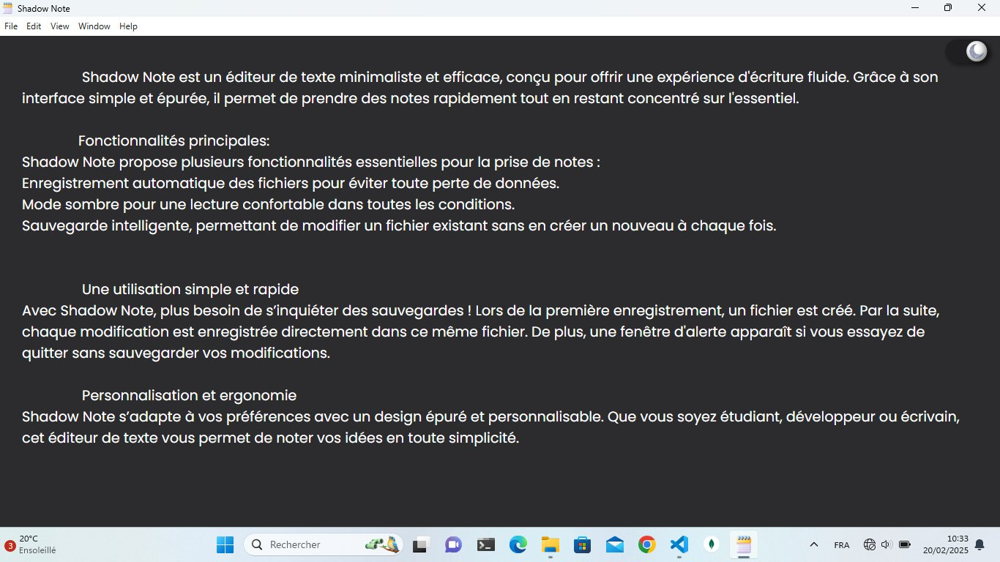
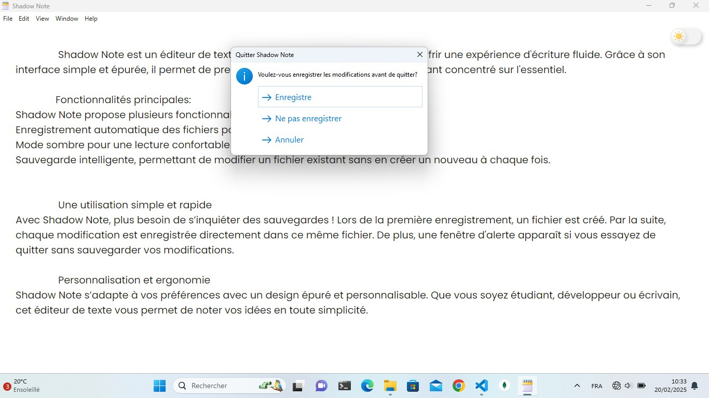

# ShadowNote

## Description

ShadowNote is a simple, lightweight notepad application built with **Electron.js**. It features a **dark mode toggle** for a better user experience, especially in low-light environments.

## Features

- 📝 Simple text editor
- 🌙 Dark mode toggle
- 💾 Lightweight and fast

## Usage

- Run the application and start writing your notes.
- Click on the **🌙 Dark Mode** button to toggle between light and dark themes.

## Technologies Used

- **Electron.js** - For building the desktop application
- **HTML, CSS, JavaScript** - For the UI and interactions

## Screenshots

## Contributing

Feel free to submit issues and pull requests to improve the project!
